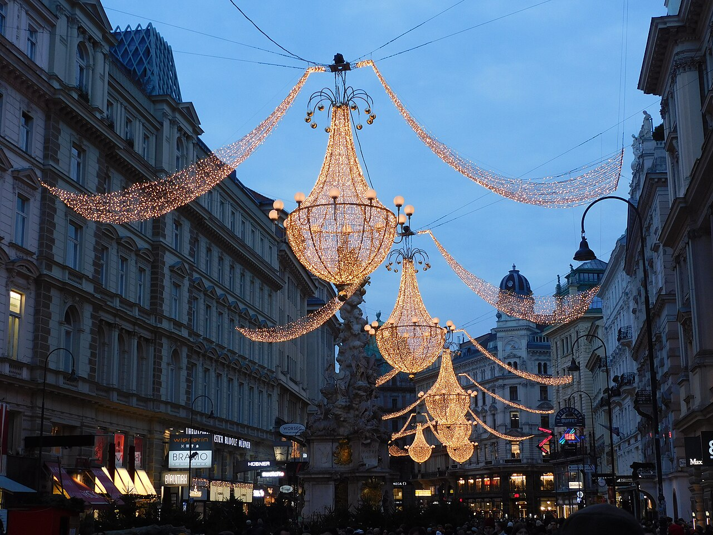
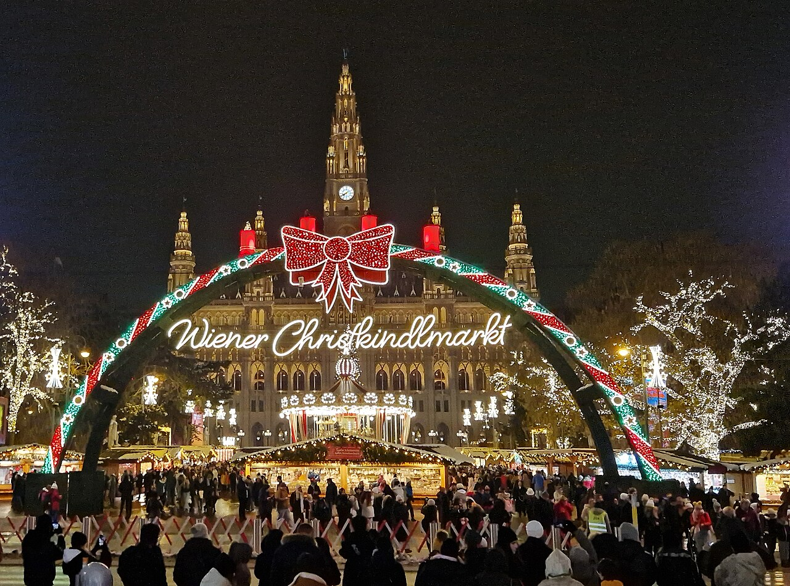
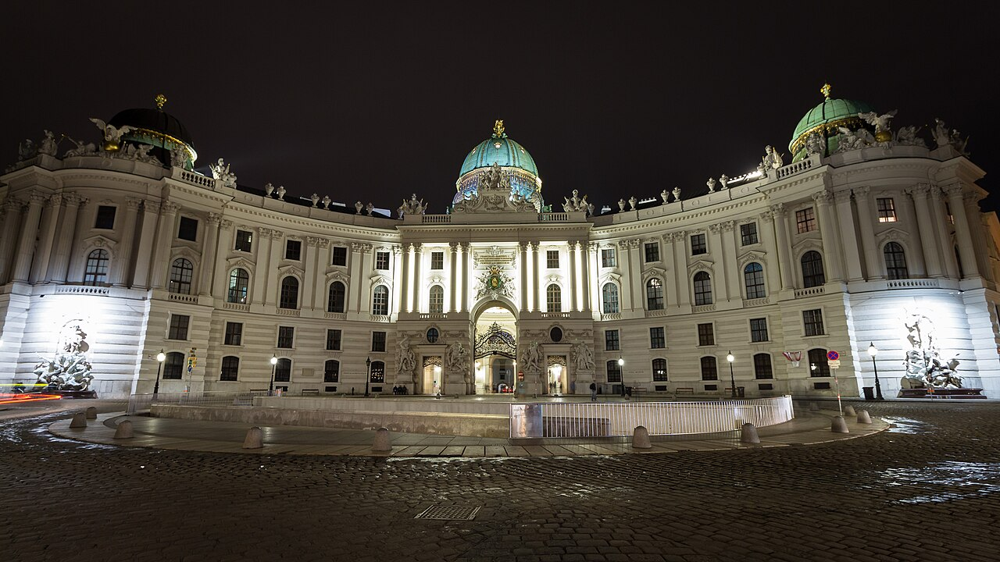
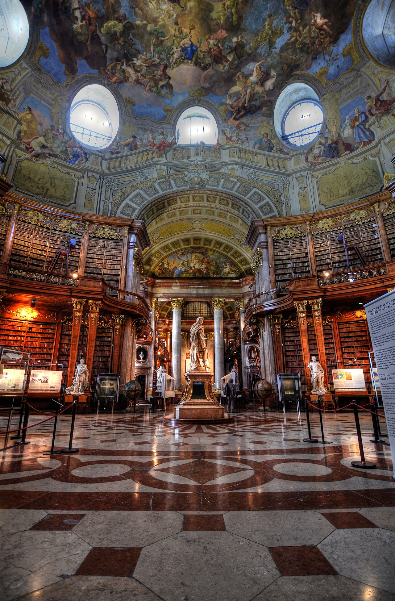
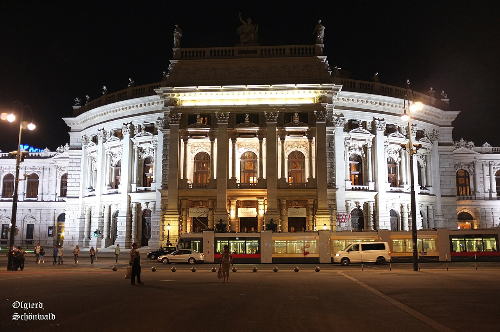

# Wien · 18.–20. Dezember 2026

Weihnachtsmärkte · *Die Physiker*, Premiere im Burgtheater

## Freitag, 18. Dezember

| Zeit | Programm | Info | Buchen |
|---|---|---|---|
| 13.30 | Flughafen Zürich | Abflug 15.05 | |
| 16.25 | Ankunft Flughafen Wien | Zug + Bus → [Anreise](#anreise) | |
| 17.50 | [Boutique Hotel Columbia](https://www.google.com/maps/search/?api=1&query=Boutique+Hotel+Columbia%2C+Kochgasse+9%2C+1080+Wien) | Kochgasse 9 · Check-in bis 22.00 | |
| 18.05 | [Weihnachtsmarkt Rathausplatz](https://www.google.com/maps/search/?api=1&query=Christkindlmarkt+Rathausplatz%2C+Wien) | 8 Min. zu Fuss · bis 22.00 | |
| 18.45 | [Weihnachtsmarkt Spittelberg](https://www.google.com/maps/search/?api=1&query=Weihnachtsmarkt+Spittelberg%2C+Spittelberggasse%2C+Wien) | Kunsthandwerk · 15 Min. zu Fuss · bis 21.30 | |
| 20.00 | [TIAN Bistro](https://www.google.com/maps/search/?api=1&query=TIAN+Bistro%2C+Schrankgasse+4%2C+1070+Wien) | Abendessen · vegetarisch · Schrankgasse 4 | **[Reservieren](https://www.tian-bistro.com)** |
| 22.00 | [DINO's Apothecary Bar](https://www.google.com/maps/search/?api=1&query=DINO%27s+Apothecary+Bar%2C+Salzgries+19%2C+Wien) | Cocktailbar · Salzgries 19 · 10 Min. Uber | **[Reservieren](https://dinos.at)** |

## Samstag, 19. Dezember

| Zeit | Programm | Info | Buchen |
|---|---|---|---|
| 8.30 | [Café Bräunerhof](https://www.google.com/maps/search/?api=1&query=Caf%C3%A9+Br%C3%A4unerhof%2C+Stallburggasse+2%2C+Wien) | Frühstück · Stallburggasse 2 | **[Reservieren](https://cafebraeunerhof.at)** |
| 10.00 | [Hofburg](https://www.google.com/maps/search/?api=1&query=Kaiserappartements+Sisi+Museum+Hofburg%2C+Michaelerkuppel%2C+Wien) | Kaiserappartements + Sisi Museum · ca. 2 Std. | **[Tickets](https://www.sisimuseum-hofburg.at/unsere-tickets/tickets-preise)** |
| 12.00 | [Kohlmarkt → Graben → Peterskirche](https://www.google.com/maps/dir/?api=1&origin=Michaelerplatz%2C+Wien&destination=Peterskirche%2C+Petersplatz%2C+Wien&waypoints=Kohlmarkt%2C+Wien%7CGraben%2C+Wien&travelmode=walking) | Spaziergang · Kirche Eintritt frei | |
| 13.00 | [Zum Schwarzen Kameel](https://www.google.com/maps/search/?api=1&query=Zum+Schwarzen+Kameel%2C+Bognergasse+5%2C+Wien) | Mittagessen · Restaurant 1. Stock · Bognergasse 5 | **[Reservieren](https://www.kameel.at)** |
| 14.45 | [Stephansdom](https://www.google.com/maps/search/?api=1&query=Stephansdom%2C+Stephansplatz%2C+Wien) | 7 Min. zu Fuss | |
| 15.30 | [Prunksaal der Nationalbibliothek](https://www.google.com/maps/search/?api=1&query=Prunksaal+Nationalbibliothek%2C+Josefsplatz+1%2C+Wien) | Barocker Bibliothekssaal · Josefsplatz 1 | **[Tickets](https://www.onb.ac.at/museen/prunksaal)** |
| 16.40 | [Café Landtmann](https://www.google.com/maps/search/?api=1&query=Caf%C3%A9+Landtmann%2C+Universit%C3%A4tsring+4%2C+Wien) | Kaffee und Kuchen · Universitätsring 4 | **[Reservieren](https://www.landtmann.at)** |
| 17.30 | Hotel | umziehen · 10 Min. zu Fuss | |
| 18.25 | [Burgtheater](https://www.google.com/maps/search/?api=1&query=Burgtheater%2C+Universit%C3%A4tsring+2%2C+Wien) | Universitätsring 2 → [Theaterabend](#theaterabend) | |
| 19.30 | *Die Physiker*, Premiere | | |
| ca. 22.30 | Hotel | 10 Min. zu Fuss | |

### Theaterabend

| Zeit | Ablauf |
|---|---|
| 18.30 | Foyers offen |
| 18.45 | Buffet 1. Pausenfoyer offen |
| 19.30 | Beginn |

| Theater | Details |
|---|---|
| Stück | Friedrich Dürrenmatt, *Die Physiker* · neuer Epilog von Wilke Weermann |
| Garderobe | Pflicht für Mäntel · im Ticket enthalten |
| Nacheinlass | nur in der Pause |
| Getränke | **[Vorbestellen](https://my.smorder.at/web/locations/9841/events)** für Einlass und Pause · ab ca. 12.12. bis 19.12., 16.30 |
| Kontakt | +43 1 51444 4545 · [burgtheater.at](https://www.burgtheater.at) |

## Sonntag, 20. Dezember

| Zeit | Programm | Info | Buchen |
|---|---|---|---|
| 8.40 | Check-out | Gepäck mitnehmen | |
| 9.00 | [Ulrich](https://www.google.com/maps/search/?api=1&query=Ulrich%2C+St.-Ulrichs-Platz+1%2C+Wien) | Brunch · St.-Ulrichs-Platz 1 · 5 Min. Uber | **[Reservieren](https://www.ulrichwien.at)** |
| 10.15 | Abfahrt zum Flughafen | Tram + Zug → [Anreise](#anreise) | |
| 11.00 | Flughafen Wien | | |
| 12.55 | Abflug | Ankunft Zürich 14.20 | |

## Anreise

**Freitag · Flughafen Wien → Hotel** · [Route](https://www.google.com/maps/dir/?api=1&origin=Flughafen+Wien-Schwechat&destination=Kochgasse+9%2C+1080+Wien&travelmode=transit)

| Ab | An | Verbindung | Info |
|---|---|---|---|
| 17.02 | 17.17 | Zug Flughafen → Wien Hauptbahnhof | Railjet, Intercity oder REX7 · nicht S7 |
| ca. 17.20 | ca. 17.45 | Bus 13A → Laudongasse (Kochgasse) | ab Hauptbahnhof, Seite Wiedner Gürtel |

**Sonntag · Ulrich → Flughafen Wien** · [Route](https://www.google.com/maps/dir/?api=1&origin=St.-Ulrichs-Platz+1%2C+1070+Wien&destination=Flughafen+Wien-Schwechat&travelmode=transit)

| Ab | An | Verbindung | Info |
|---|---|---|---|
| 10.15 | 10.21 | zu Fuss → Ring/Volkstheater | |
| ca. 10.22 | ca. 10.35 | Tram D → Hauptbahnhof Ost | |
| 10.40 | 10.57 | Zug → Flughafen | nächster 10.53 |

**Tickets · ÖBB-App**

| Fahrt | Ticket | Gilt für |
|---|---|---|
| Freitag | Flughafen Wien → Wien · 2 Personen | Zug, Bus, Tram, U-Bahn |
| Sonntag | Wien → Flughafen Wien · 2 Personen | Zug, Bus, Tram, U-Bahn |

## Hotel

| Hotel | [Boutique Hotel Columbia](https://www.google.com/maps/search/?api=1&query=Boutique+Hotel+Columbia%2C+Kochgasse+9%2C+1080+Wien) |
|---|---|
| Adresse | Kochgasse 9, 1080 Wien |
| Check-in | Freitag, 14.00–22.00 |
| Check-out | Sonntag, bis 11.00 |

## Wetter

| Wetter | Dezember |
|---|---|
| Temperatur | 3–5 °C |
| Dunkel ab | ca. 16.00 |

Bilder: Wikimedia Commons · Graben © VasuVR, CC BY 4.0 · Rathausplatz © Geolina163, CC BY-SA 4.0 · Hofburg © Rafa Esteve, CC BY-SA 4.0 · Prunksaal © Richard Hopkins, CC BY 2.0 · Burgtheater © Olgierd Schönwald, CC BY-SA 3.0
